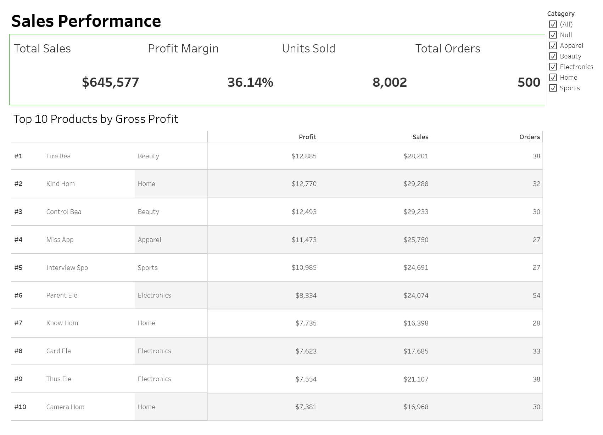
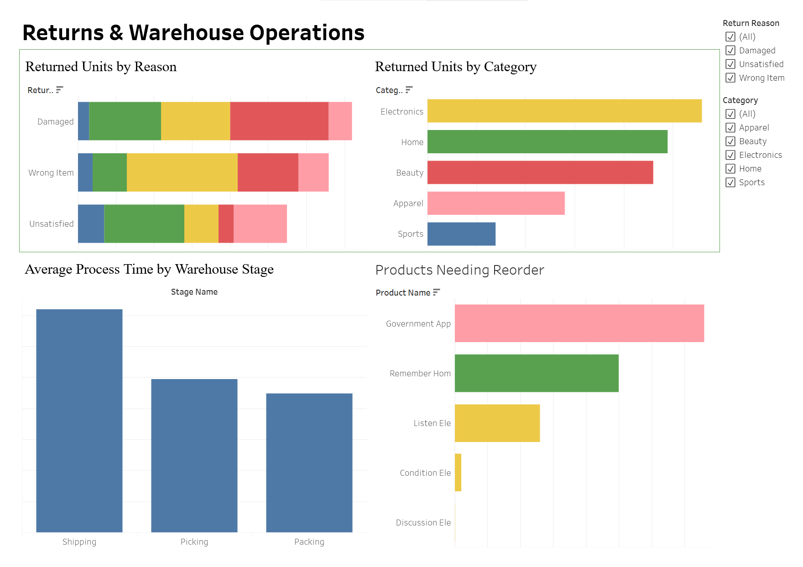

# Sales & Warehouse Operations Analytics Dashboard

## Project Overview
This project analyzes sales performance, returns, warehouse process time, and inventory reorder risk using SQL Server and Tableau Public.

## Tools Used
- SQL Server
- T-SQL
- Tableau Public
- CSV export

## Data Architecture
- Bronze layer: raw CSV-loaded tables
- Silver layer: cleaned and standardized views
- Gold layer: reporting-ready fact, dimension, and KPI views

## SQL Work
- Created bronze, silver, and gold schemas
- Cleaned customer emails, join date, order quantities, and product categories
- Handled duplicate customer records
- Built fact and dimension views for reporting
- Created KPI views for sales and return validation

## Tableau Dashboard
The Tableau dashboard includes two pages:

### 1. Sales Performance
- Total Sales
- Profit Margin
- Units Sold
- Total Orders
- Top 10 Products by Gross Profit

### 2. Returns Analysis & Warehouse Operations
- Returned Units by Reason
- Returned Units by Category
- Average Process Time by Warehouse Stage
- Products Needing Reorder

## Key Insights
- Total sales reached $645.6K across 500 orders.
- Gross profit margin was 36.14%.
- Electronics had the highest returned units by category.
- Shipping had the longest average warehouse process time.
- Several products were below reorder level and required replenishment.

## Dashboard Link
[[warehouse-dashboard-project]](https://public.tableau.com/views/warehouse-dashboard-project/Story1?:language=en-US&:sid=&:redirect=auth&:display_count=n&:origin=viz_share_link)

## Screenshots

